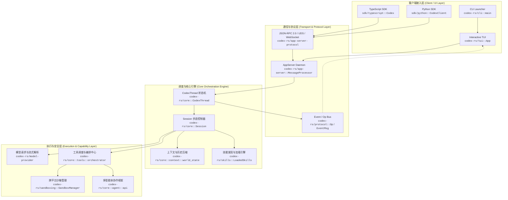
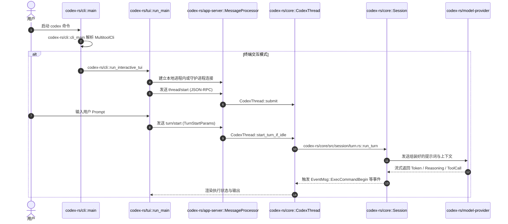

# Codex 核心架构图谱与符号索引

本文档为 Harry 个人学习工作区的核心架构索引。全面采用**符号锚定原则**（「文件路径 + 类名/函数名/结构体名」坐标，不使用易变物理行号），并附带关键节点真实数据样例。

---

## 1. 核心架构全景图



---

## 2. 核心入口与启动链路



### 启动链路坐标定义
1. **进程主入口**：
   - 坐标：[`codex-rs/cli/src/main.rs::main`](file:///Users/zhanghongze/PycharmProjects/codex/codex-rs/cli/src/main.rs)
   - 职责：初始化构建信息，检测远程控制环境变量，执行 `codex_arg0::arg0_dispatch_or_else`（根据启动时的程序别名，比如是不是作为特定子工具直接调用的，进行快速分发），然后进入异步主函数 `cli_main`。
2. **CLI 分发主控**：
   - 坐标：[`codex-rs/cli/src/main.rs::cli_main`](file:///Users/zhanghongze/PycharmProjects/codex/codex-rs/cli/src/main.rs)
   - 职责：解析命令行参数结构体 `MultitoolCli`，合并 `--enable`/`--disable` 特性标记至配置覆盖项，根据子命令分发至 `exec`、`review`、`mcp`、`app-server` 或默认交互式 TUI。
3. **TUI 运行时接入**：
   - 坐标：[`codex-rs/cli/src/main.rs::run_interactive_tui`](file:///Users/zhanghongze/PycharmProjects/codex/codex-rs/cli/src/main.rs)
   - 职责：检查终端类型（过滤 Dumb 终端），按需拉起后台守护进程，调用 `codex_tui::run_main`。
4. **TUI 界面主循环**：
   - 坐标：[`codex-rs/tui/src/lib.rs::run_main`](file:///Users/zhanghongze/PycharmProjects/codex/codex-rs/tui/src/lib.rs)
   - 职责：启动 Ratatui 渲染驱动，构建聊天交互视窗（[`ChatWidget`](file:///Users/zhanghongze/PycharmProjects/codex/codex-rs/tui/src/chatwidget.rs)），管理输入缓冲区与按键映射。
5. **核心线程创建与协调**：
   - 坐标：[`codex-rs/core/src/codex_thread.rs::CodexThread`](file:///Users/zhanghongze/PycharmProjects/codex/codex-rs/core/src/codex_thread.rs)
   - 职责：维护线程生命周期，串行处理 Turn 任务，提供统一事件通道 `next_event()`，管理多轮记忆模式与环境策略。

---

## 3. 各子模块职责与关键符号清单

### 3.1 客户端与交互模块
| 模块 / 路径 | 核心符号 | 职责与功能 |
| :--- | :--- | :--- |
| [codex-rs/cli](file:///Users/zhanghongze/PycharmProjects/codex/codex-rs/cli) | `MultitoolCli`<br/>`cli_main`<br/>`run_interactive_tui` | 命令行参数解析、子命令分发、环境探测与应用退出恢复 |
| [codex-rs/tui](file:///Users/zhanghongze/PycharmProjects/codex/codex-rs/tui) | `App`<br/>`run_main`<br/>`ChatWidget`<br/>`SkillsToggleView` | 终端界面渲染（Ratatui）、快捷键驱动、实时流式 Markdown 格式化、技能弹出菜单 |
| [sdk/python](file:///Users/zhanghongze/PycharmProjects/codex/sdk/python) | `openai_codex::CodexClient`<br/>`openai_codex::AsyncCodexClient` | Python 语言客户端绑定，支持本地应用服务器桥接与类型化 RPC 调用 |
| [sdk/typescript](file:///Users/zhanghongze/PycharmProjects/codex/sdk/typescript) | `Codex`<br/>`Thread`<br/>`CodexOptions` | Node.js / TypeScript 语言 SDK，支持结构化输出（Zod）与进程生命周期管理 |

### 3.2 协议与应用服务模块
| 模块 / 路径 | 核心符号 | 职责与功能 |
| :--- | :--- | :--- |
| [codex-rs/app-server](file:///Users/zhanghongze/PycharmProjects/codex/codex-rs/app-server) | `MessageProcessor`<br/>`ConfigManager`<br/>`start_stdio_connection` | 处理 JSON-RPC 2.0 请求，管理跨进程与网络连接，分发 ServerNotification |
| [codex-rs/app-server-protocol](file:///Users/zhanghongze/PycharmProjects/codex/codex-rs/app-server-protocol) | `TurnStartParams`<br/>`TurnStartResponse`<br/>`JSONRPCMessage` | 定义 v1/v2 协议数据载荷，提供跨语言 TypeScript/JSON Schema 生成器 |
| [codex-rs/protocol](file:///Users/zhanghongze/PycharmProjects/codex/codex-rs/protocol) | `Op`<br/>`EventMsg`<br/>[`UserInput`](file:///Users/zhanghongze/PycharmProjects/codex/codex-rs/protocol/src/user_input.rs)（定义于 `user_input.rs`）<br/>`SandboxPolicy` | 核心协议类型定义，承载所有线程操作、审批策略与执行阶段事件 |

### 3.3 核心引擎与调度模块
| 模块 / 路径 | 核心符号 | 职责与功能 |
| :--- | :--- | :--- |
| [codex-rs/core](file:///Users/zhanghongze/PycharmProjects/codex/codex-rs/core) | `CodexThread`<br/>`Session`<br/>`TurnContext`<br/>`StepContext` | 驱动智能体对话回合，组装上下文提示词，执行步进状态循环与流式响应 |
| [codex-rs/core::context](file:///Users/zhanghongze/PycharmProjects/codex/codex-rs/core/src/context) | `WorldState`<br/>`DeveloperInstructions`<br/>`ManagedDeveloperInstructions` | 构建包含当前文件树、环境变更、系统时间及指导规范的动态世界状态 |
| [codex-rs/skills](file:///Users/zhanghongze/PycharmProjects/codex/codex-rs/skills) | `LoadedSkills`<br/>`parse_skill_frontmatter_metadata`<br/>`extract_tool_mentions` | 扫描 `.system` 及工作区 Skills，解析 Frontmatter 元数据并按需注入上下文 |
| [codex-rs/model-provider](file:///Users/zhanghongze/PycharmProjects/codex/codex-rs/model-provider) | `ModelProvider`<br/>[`ModelProviderInfo`](file:///Users/zhanghongze/PycharmProjects/codex/codex-rs/model-provider-info/src/lib.rs)（位于 `model-provider-info`） | 屏蔽不同 LLM 提供商差异（OpenAI, ChatGPT Web, Ollama, LMStudio） |

### 3.4 工具执行与沙箱模块
| 模块 / 路径 | 核心符号 | 职责与功能 |
| :--- | :--- | :--- |
| [codex-rs/tools](file:///Users/zhanghongze/PycharmProjects/codex/codex-rs/tools) | `ToolCall`<br/>`ResponsesApiTool`<br/>`JsonSchema` | 工具接口抽象、参数校验 Schema 定义与 Code Mode 适配器 |
| [codex-rs/core::tools::handlers::unified_exec](file:///Users/zhanghongze/PycharmProjects/codex/codex-rs/core/src/tools/handlers/unified_exec.rs) | [`ExecCommandHandler`](file:///Users/zhanghongze/PycharmProjects/codex/codex-rs/core/src/tools/handlers/unified_exec/exec_command.rs)（定义于 `exec_command.rs`）<br/>[`WriteStdinHandler`](file:///Users/zhanghongze/PycharmProjects/codex/codex-rs/core/src/tools/handlers/unified_exec/write_stdin.rs)（定义于 `write_stdin.rs`） | 终端命令行执行器，受沙箱策略严格约束，支持 TTY 与流式标准输出捕获 |
| [codex-rs/core::tools::handlers::apply_patch](file:///Users/zhanghongze/PycharmProjects/codex/codex-rs/core/src/tools/handlers/apply_patch.rs) | `ApplyPatchHandler`<br/>独立底包 [codex-rs/apply-patch](file:///Users/zhanghongze/PycharmProjects/codex/codex-rs/apply-patch)：`StreamingPatchParser`、`apply_patch` | 解析标准 Unified Diff 补丁并安全应用到本地文件，底包提供流式解析与补丁应用算法，Handler 负责编排与追踪改动差异 |
| [codex-rs/core::tools::handlers::multi_agents_v2](file:///Users/zhanghongze/PycharmProjects/codex/codex-rs/core/src/tools/handlers/multi_agents_v2.rs) | `spawn`<br/>`send_message`<br/>`wait`<br/>`interrupt_agent` | 多 Agent 协作工具集，支持主智能体创建子会话、传递异步消息与汇总结论 |
| [codex-rs/sandboxing](file:///Users/zhanghongze/PycharmProjects/codex/codex-rs/sandboxing) | `SandboxManager`<br/>`seatbelt` (macOS)<br/>`bwrap` (Linux) | 平台底层进程隔离，拦截未授权的文件读写与非法外部网络请求 |

---

## 4. 关键数据结构与契约示例

### 4.1 发起回合输入载荷 (`TurnStartParams`)
坐标：[`codex-rs/app-server-protocol/src/protocol/v2/turn.rs::TurnStartParams`](file:///Users/zhanghongze/PycharmProjects/codex/codex-rs/app-server-protocol/src/protocol/v2/turn.rs)

> [!NOTE]
> 安全沙箱策略（`sandbox`）与审批模式（`approval_policy: AskForApproval`）属于线程级全局参数，在 [`ThreadStartParams`](file:///Users/zhanghongze/PycharmProjects/codex/codex-rs/app-server-protocol/src/protocol/v2/thread.rs) 中声明；回合级 [`TurnStartParams`](file:///Users/zhanghongze/PycharmProjects/codex/codex-rs/app-server-protocol/src/protocol/v2/turn.rs) 聚焦于回合输入 `input` 与工作目录覆写 `cwd`。

```json
{
  "threadId": "thr_01h7abc123xyz",
  "input": [
    {
      "type": "text",
      "text": "分析项目启动入口并修复 Cargo.toml 中的依赖警告"
    }
  ],
  "cwd": "/Users/zhanghongze/PycharmProjects/codex"
}
```

### 4.2 统一命令执行参数 (`ExecCommandArgs`)
坐标：[`codex-rs/core/src/tools/handlers/unified_exec.rs::ExecCommandArgs`](file:///Users/zhanghongze/PycharmProjects/codex/codex-rs/core/src/tools/handlers/unified_exec.rs)

> [!NOTE]
> 该样例为运行时命令执行入参。在底层实现中，它由 [`ExecCommandEnvironmentArgs`](file:///Users/zhanghongze/PycharmProjects/codex/codex-rs/core/src/tools/handlers/unified_exec.rs)（提供 `workdir` 等环境参数）与 [`ExecCommandArgs`](file:///Users/zhanghongze/PycharmProjects/codex/codex-rs/core/src/tools/handlers/unified_exec.rs)（提供 `cmd`, `tty`, `timeout_ms` 等核心参数）合并解析。

```json
{
  "cmd": "cargo check --workspace",
  "workdir": "/Users/zhanghongze/PycharmProjects/codex",
  "timeout_ms": 30000,
  "tty": false,
  "yield_time_ms": 1000,
  "justification": "验证代码编译状态与类型检查"
}
```

### 4.3 核心事件消息流 (`EventMsg`)
坐标：[`codex-rs/protocol/src/protocol.rs::EventMsg`](file:///Users/zhanghongze/PycharmProjects/codex/codex-rs/protocol/src/protocol.rs)
```json
{
  "type": "task_started",
  "turn_id": "turn_998877"
}
```
```json
{
  "type": "exec_command_begin",
  "call_id": "call_cmd_01",
  "turn_id": "turn_998877",
  "command": [
    "cargo",
    "check",
    "--workspace"
  ],
  "cwd": "/Users/zhanghongze/PycharmProjects/codex"
}
```
```json
{
  "type": "exec_command_output_delta",
  "call_id": "call_cmd_01",
  "stream": "stdout",
  "chunk": [70, 105, 110, 105, 115, 104, 101, 100, 10]
}
```
（注：底层协议以 `stream` 及字节数组 `chunk` 传输原始流数据，终端接收端解码后还原为字符文本显示）
```json
{
  "type": "task_complete",
  "turn_id": "turn_998877"
}
```

---

## 5. 核心生命周期流转流程

```mermaid
stateDiagram-v2
    [*] --> Idle: 线程初始化 (CodexThread::new)
    Idle --> PreparingTurn: 收到 TurnStartParams
    PreparingTurn --> AssemblingContext: 提取 WorldState + Skills + 历史记忆
    AssemblingContext --> RequestingModel: 构造提示词 -> 投递 ModelProvider
    RequestingModel --> StreamingResponse: LLM 流式推理由此产生
    
    state StreamingResponse {
        [*] --> Reasoning: AgentReasoningEvent
        Reasoning --> EmittingContent: AgentMessageEvent
        EmittingContent --> ToolCallRequested: 工具调用生成
    }
    
    ToolCallRequested --> Approving: 检查 SandboxPolicy & AskForApproval (审批策略)
    Approving --> ExecutingTool: 用户批准或自动策略放行
    ExecutingTool --> SandboxWrapper: 进入 macOS Seatbelt / Linux bwrap
    SandboxWrapper --> ToolCompleted: 捕获输出或文件差异
    ToolCompleted --> RequestingModel: 结果写回会话 -> 进行下一轮推理
    
    StreamingResponse --> TurnCompleted: 模型输出终态停止符
    TurnCompleted --> CompactingHistory: 历史 Token 超限时执行 Compaction
    CompactingHistory --> Idle: 就绪等待下一次调用
```

